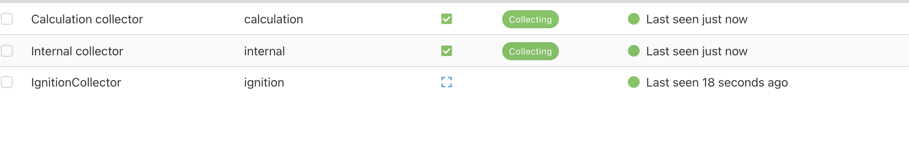

# Weekly Meetings

# 09/03/2026 — Collect Tag Changes (Collector)

First version of sending tag changes to the Factry collector.

Prior work:
  - Scaffolded the Ignition module
  - Wrote the design document
  - Installed the module, created a historian, and assigned it to a tag

Recently:
  - Implemented gRPC collector integration for the module
  - Tidied up documentation
  - Some clarifications

See [setup_environment.md](setup_environment.md) for setup instructions.

> This falls under "Milestone 1: Proof of Concept" (proposed milestones).
> (Milestone 2: Historian Collector Full implementation)

Known issues:
  - Store and forward is not yet implemented (in progress)
  - Editing settings is not possible in Ignition; the historian must be recreated

> Terminology:
>  - Store (Ignition) → Collector (Factry) — writing tag data                 
>  - Query (Ignition) → Provider (Factry) — reading data back

Questions:
  - tag name: 'prov:default:/tag:Alma' 
  - The provider query API is not yet available, but browsing measurements can already be done. Only measurements, or also assets/calculations?
  - Should we set up a docker-compose with everything (Ignition + Factry Historian + databases)?
  - How should the module and Ignition be installed (Docker)?
  - Documentation structure:
      - Design document and related assets
      - Module signing guide
      - Try-out guide

# 16/03/2026

Done:
 [+] bug: creating two measurements for one tag, because it didn't wait for the first
 [+] Editing settings
 [+] Store and forward
 
> (Milestone 2: Historian Collector Full implementation < is this enough?)

 [+] preliminary protobuf + emulator
 [+] Browsing measurements from the emulator
 
known issue:
  - missing point in store and forward
  - new point is not always flushed 
  - if the requests fails for measuremnts -> shows old instead of empty

> remark: one 'store and forward' object can serve several historian (or anything else), the pathtag includes the provider

Questions:
  - measurements | calculation | assets in separate folder?
> the protobuf with the new query data is welcome as soon as possible
  - wait for the protobuf or go further? 

# 23/03/2026

changes/remarks:

>   *pending* : points queue, the ignition S&F tries to send them periodically
> 
>   *quarantined* :  malformed points
>       how to decide if network error or malformed point: we need a proper error message in case of the second

 
  + missing point in store and forward
     
     . isEngineUnavailable() < always returned false, now it is correct (checks periodically)
     
     . adds a 3-second deadline to createPoints() so failures are detected quickly
          flag flips to disconnected and isEngineUnavailable() returns true
     
     . possible improvement: return error is it is malformed otherwise  set isEngineUnavailable()

  + if the requests fails for measurements -> shows old instead of empty

>  + *new point is not always flushed*:
>   This is standard Ignition historian behavior, not a bug in our code. The current value gets flushed when the next value change occurs.
>   That's a classic off-by-one timing issue — Ignition's historian likely sends the previous value when a new change arrives (that's how SourceChangePoint / deadband works: it confirms the old value held until the new one arrived). 
>

  + handleChangeSettings — all classes is in the code  support dynamic
  settings changes without module restart                                     
  + Logging improvements — FactryHistoryProvider logging adjustments         
  + testConnection() + getStatus polling — FactryGrpcClient got a            
  testConnection() method; FactryHistoryProvider polls 30 seconds to  
  track connection status                                                     
  + Aggregated query support — FactryQueryEngine got 
      doQueryAggregated() 
      getNativeAggregates() < list, but not sure it is correct
  + Metrics — New HistorianMetrics class (118 lines) for tracking store/query
   performance

  + adopted new proto from factrylabs/historian-proto 
    - replaced QueryRawPoints with QueryTimeseries (no aggregation = raw query)
    - removed Calculations as a separate concept, no separate folder in Power Chart tag browser
    - updated Asset message to new richer format (parentUUID, assetPath, attributes, metadata)
    - replaced GetAssets(AssetRequest) with GetAssets(GetAssetsRequest) with filtering support
    - updated Aggregation fields: function→name, fill→fillType, added arguments
    - updated fake gRPC server with all new RPCs
 

Questions about the new proto:
  - Series.fields (repeated string) < Column names for multi-value series
  - QueryTimeseriesRequest.join (bool) - skip, not important
  - QueryTimeseriesRequest.onlyChanges (bool)  - sends only changes, so 1,2,2,3 -> 1,2,3
  

Other questions
  - what should happen if the tag is removed? should we remove the measurements?
      FactryStorageEngine.applySourceChanges explicitly does nothing, just logs a debug message                          
  - what does the calculation collector mean
  - testing strategies?
      - automated scripts on gateway to change the tags
      - run the jython code the get the data
      - insert a lot of data, check the performance
      - compare the performance to grafana
      - send integer first, try to send float
      - change to discrete, is the last point immediatly send
    -   

# 30/03/2026

changes:
  - TLS: Added "Skip TLS Verification" setting, proper cert validation by default
    (it skipped automatically before)
    Question:
     If publicly-signed: nothing to do
     If self-signed/internal CA: we'd need a setting for the user to provide a CA  
  certificate path.
  
  - Config validation: FactryHistorianSettings.validate() — checks host, port,     
  collectorUUID, batchSize, batchIntervalMs    
     (use token)
 
  - Malformed point handling: StatusRuntimeException catch distinguishes             
     UNAVAILABLE/DEADLINE_EXCEEDED (retry) from INVALID_ARGUMENT (quarantine)
  
  - Logging cleanup: ~50 logger.info() calls downgraded to debug(), separator banners
   removed                 

  - little refactor: 
      gRPC client refactor: extracted buildChannel() and tlsLabel(), eliminated code   
  duplication   

  - unit tests:                                                                   
      - FactryHistorianSettingsTest — 18 tests for validation                            
      - HistorianMetricsTest — 10 tests for metrics tracking                           
      - Added historian-gateway-api and slf4j-simple test dependencies    

  - Ingition files/example project commited into the git repo

  - boundaries (bounding values flag):
        asking -1 and +1 point for the period 
        
        we can fake it with two extra
        queries:                                                                              
                                                    
        1. Lower bound: QueryTimeseries with end = start, desc = true, limit = 1 → last point before start                                                                         
        2. Upper bound: QueryTimeseries with start = end, limit = 1 → first point after end   
                                                                                              
        That's 2 extra gRPC calls per query though. The alternative would be to add an        
        includeBoundingValues field to the proto, but that requires changes on the Go backend 
        side too.                                                                             

Still to do:
  - So metadata flows one direction only: 
       Factry → Ignition 
       create tag with metadata in Ignition --/--> is not sent to Factry
                                                                      

  - Integration tests (working on it)                                                                          
      webdev module let you to run scripts on the gateway
       - call the script 
       - check the result (e.g. points arrived to Factry or aggragetation is correct)

  - Null check in FactryGrpcClient.shutdown()                                        
  - Race condition in handleSettingsChange()
  - Silent exception swallowing in doBrowse()                                        
  - Hardcoded timeouts not yet configurable          

# 13/04/2026

changes:
  - use the generated token instead of port/uuid, name, etc.
     remark: - the token will be visible in ignition (plain text store), this might be risk, if somebody has access to ignition file system. However, that is rarely the case. 
             - we could store the token in secret, but it comes with None/Embedded/Referenced radio UI, which is simple just strange 

  -  using Factry image v8.2.0-beta
  -  Hardcoded timeouts not yet configurable into factry-historian.properties
  -  issue: new point to measurement silently fails, if measurement doesn't exist
       solution:  Periodic measurement cache refresh (30sec) to detect deleted measurements
  - Race condition in handleSettingsChange()
 
remarks:
  - script to query data from the new factry (it fails)
  - blocked at filling default data to the config page of the historian 
  - pull request is open and it is growing
  - failed methods can only send log error, but not other way to notify user
        (for example in case of browsing the measurement/assets)

Still: 
  - more tests (test with Factry, test with calling Ignition endpoint for running scripts)
  - check metadata flows
  - build in CA certificate
  - unit tests

# 20/04/2026
  - Factry CA certificate bundled in module JAR (gateway/src/main/resources/factry-historian-ca.crt). Used for TLS verification when skipTlsVerification is false.
  - testing with new factry historian version 
  - unit testing './gradlew cleanTest test':
      Test results: SUCCESS (74 tests, 74 passed, 0 failed, 0 skipped)
  - integration testing 
      - script loaded to ignition
      - script is executed on the gateway with webdev
      - scripts does something (like sending data to factry)
      - returns result
      - integration test can call factry directly(check if data is there)
      - show success/failure

Next is prepare for version 1.0:
  - good unit test coverage
  - good integration test coverage
  - documentation 
  - check feature completeness (e.g. metadata flows)
  - demo 
  - code review

# 29/04/2026

Meeting at Factry office.

Plan:
  + create factry own certificate and add to the cicd
  + test with only downloading the module and installing Ignition
  

  - Make Demo working on on Wannes's computer (running docker compose)
  - Tests:
      - manual
      - automated tests
  + Doc/Code Review
  + Making follow-up list

Follow-ups:
  - Wannes: make licence html
  - Gabor: add suggested values for batch_size 10 and batch interval 5000
  - Gabor: ignition projects didn't appear
  - running integrationTest need to be smoother, some failed

  - two ignitions with two different collectors  ( same collector doesn't define unique name: coll1/default/var1 can come form two different ignition)
  - two ignitions, one with factry historian, one with remote historian
  - more integrationTest, more unitTest
  - automatize the setup for integration test. 
------
# 8/05/2026
 
Changes:
  + Gabor: add suggested values for batch_size 10 and batch interval 5000 on the **config**
  + I added an **numeric array tag** to the tag browser and populated it using the script console, it appeared in historian but as a separate measurement for each index (see screenshot array-test.png)
  + strange numbers in the metrics logs in ignition << **removed** this was for debugging
  + warnig for the token, solved with **@NonSecret**
  + assets in powerchart tag browser in power chart d
  + docker-compose.yaml
      JWT_SECRET: "factry-dev-secret-do-not-use-in-production" 

Question: 
  - the collector token only gives access to its own measurements  
     I don't get back all the other collectors

  - Wannes: make licence html  
  - CONTENT NOT FOUND:  https://docs.factry.io/installing-factry-historian-using-docker#installing-your-first-collector
  
  https://docs.factry.io/installing-factry-historian-using-docker-for-testing-purposes
  - What
     Wannes: collector has to call RegisterCollector to move the from status Initial  
     grpcClient.registerCollector is called, what is still missing. 

  - new idea: create the store&forward engine automatic, always use it
     right now: - create db 
                - every db can be used as store and forward engine
                - explicitely use it

  - when parsing points return from the historian it looks like you always set quality to Good, the Status we return on a point could potentially be used for this (statusToQuality function in FactryQueryEngine does not seem to be used)   

Still:
  - easier setup: combination of scripts and manual step 
  - more tests: both manual and automated      
  - two ignitions with two different collectors  ( same collector doesn't define unique name: coll1/default/var1 can come form two different ignition)
  - two ignitions, one with factry historian, one with remote historian   

# 18/05/2026

Solved:

  [+] use GetMeasurementByFilter to get all the measurements of different collectors

  [+] create the store&forward engine automatic
  
  [+] FactryQueryEngine query grouped by the status=good << let's plot only the good quality data   
  
  [+] array through the store&forward

Pending:

  [] licence html  
  
  [] grpcClient.registerCollector (no correct effect)
  
  [] Collector names (we use collector's uid )
  
  [] getMeasurementsByFilter returns with  100 results, suspecious

goal: feature freeze   

# 28/05/2026

Done:

  [+] Collector names (we use collector's uid )
  [+] pagination for getMeasurementsByFilter
  [+] test with realfakedata

Questions:
  
  - Measurement.collectorUUID isn;t populated by Factry
    collectorUUID='' for all measuremens
  - licence html  < add placeholder
  
  - remove 'hack' to use historian when the host is localhost

# 01/06/2026

+ remove 'hack' to use historian when the host is localhost
+ licence html  < add placeholder

- Measurement.collectorUUID isn;t populated by Factry
    collectorUUID='' for all measuremens

# 08/06/2026
+ Measurement.collectorUUID isn;t populated by Factry
    collectorUUID='' for all measurements
+ Create a label in ignition designer and assign the value of a factry historian

remark:
  - failed to make a calculation in Factry
  - Factry accepting the data even without the setup wizard completed? 
  - still testing the remote factry historian and cases when factry is down

# 15/06/2026

done:  
  + flat list for external 
  + factry is down tested: the store and forward should go to 'storage only', data goes to 'pending' list
  + manual test: all good

remarks:
  - not decided when 6000+ measurements:
     Measurement 1-100
     Measurement 101-200
     Measurement 201-300 
  - new: the delimiter on the settings page is still coming
  - tweak: create historian dialog:/replace token to the good, still we have to wait sometimes 20 second 
  - tweak: check the default values if they work with the new release 8.3.6
  - development environment auto setup is a bit out of scope, but it could be useful for testing new versions of Factry / Ignition 
  
# 22/06/2026  
done:
  + the delimiter on the settings page is still coming
  + tweak: create historian dialog:/replace token to the good, still we have to wait sometimes 20 second 

remark:
  - default values still don't work with new release 8.3.6